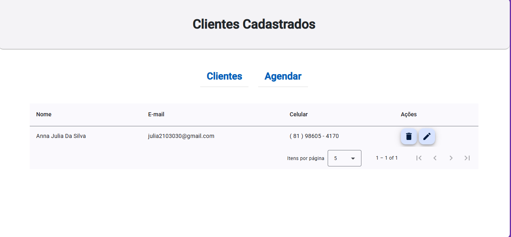

## Aplicação de Gerenciamento de Barbearia 💈 | Front-End

Este projeto é parte de uma aplicação fullstack desenvolvida para o gerenciamento de agendamentos de uma barbearia, utilizando o framework **Angular**. A plataforma permite aos usuários agendar horários de forma simples e eficiente, oferecendo uma experiência intuitiva e dinâmica. O repositório aqui presente se refere ao **front-end** da aplicação, enquanto o back-end pode ser acessado no repositório correspondente.

### Funcionalidades ⚙️

- **Interface de Agendamento:** Tela intuitiva para os clientes agendarem seus horários de forma simples e rápida.
- **Cadastro de Clientes:** Formulário de cadastro e login para os clientes acessarem seus históricos de agendamentos.
- **Notificações de Agendamento:** Exibição de notificações na interface para lembrar os clientes dos seus próximos agendamentos.
- **Interatividade Dinâmica:** Uso de formulários e botões interativos para melhorar a experiência do usuário.
- **Comunicação com o Back-End:** Consumo de APIs RESTful para integração com o back-end e gerenciamento dos dados.

### Tecnologias Utilizadas 🛠️

  

- **HTML** 🌐: Estruturação do conteúdo e layout das páginas.
- **CSS** 🎨: Estilização das páginas para garantir uma interface limpa e atraente.
- **TypeScript** 🖥️: Linguagem de programação utilizada para garantir a tipagem estática e maior segurança no código.
- **Angular** ⚡: Framework utilizado para construção de interfaces dinâmicas e escaláveis, com forte integração entre componentes.

### Estrutura do Projeto 🏗️

O front-end foi estruturado de acordo com as melhores práticas do **Angular**, com o uso de componentes, módulos e serviços para garantir uma organização eficiente. A aplicação também faz uso de recursos avançados do **Angular** para melhorar a interatividade e a performance da interface.

### Imagens do Projeto 📸

<img src="barber-shop-ui/cadastro.png"
                                                                               
---

### Contato 📞

- **LinkedIn**: [Meu LinkedIn](https://www.linkedin.com/in/anna-julia-data)
- **E-mail**: [annadsilva087@gmail.com](mailto:annadsilva087@gmail.com)

